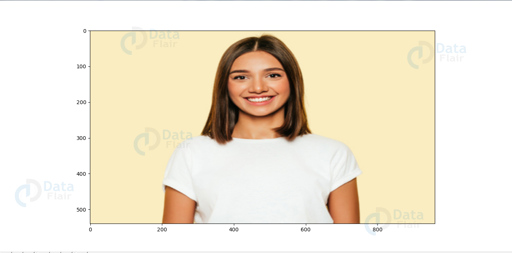
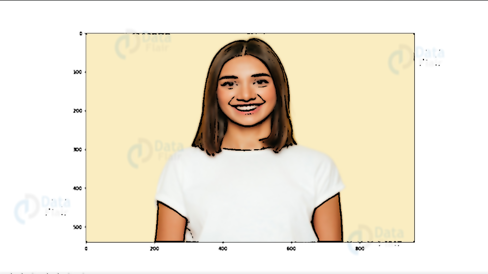

# Cartoonify-Image-OpenCV
Application that transforms images into its cartoon using Python, OpenCV(cv2), easygui, numpy, imageio, and tkinter.

Original:

Image is converted into a numpy array.

Layers:
<ul>
  <li>Image is converted to a Grayscale image.</li>
  <li>The Grayscale image is smoothened.</li>
  <li>Edges are extracted from the smoothened Grayscale image.</li> 
  <li>A lightened color image is formed to mask the edges.</li> 
  <li>Bitwise is performed on the two images to mask them.</li>
</ul>

Final Result:

